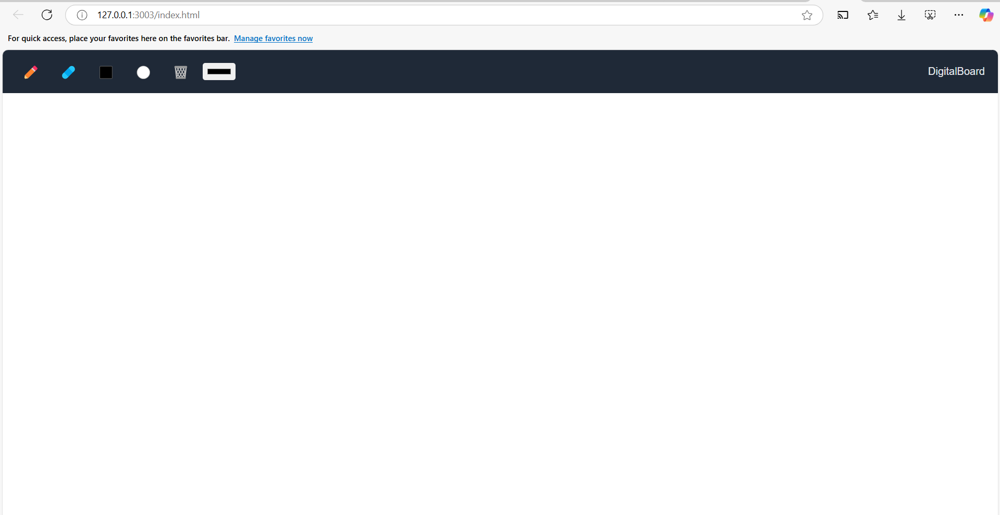

# DigitalBoard

**DigitalBoard** is an interactive, web-based drawing application that allows users to create and manipulate digital drawings in real time. DigitalBoard provides a simple yet effective canvas for drawing, erasing, and creating basic shapes such as rectangles and circles. The project offers a fluid and responsive user experience, with a toolbar to switch between drawing tools, color pickers, and other features.

## Key Features:

- **Freehand Drawing**: Draw freehand lines and shapes with adjustable colors and line thickness.
- **Shape Drawing**: Create real-time shapes such as rectangles and circles, which are previewed while being drawn.
- **Erase Mode**: Erase parts of the drawing using a simple eraser tool.
- **Color Picker**: Choose from a range of colors to customize your drawings.
- **Clear Canvas**: A button to clear the entire canvas and start afresh.
- **Real-Time Drawing**: Shapes and lines are drawn dynamically, offering immediate visual feedback.

## Technologies Used:

- **HTML5 Canvas**: For drawing shapes and handling drawing events.
- **JavaScript**: For implementing drawing logic and user interactions.
- **CSS**: For styling the application and making it responsive.

## Installation:
	Clone the repository:
   
   	git clone https://github.com/AshutoshRajS/digitalboard.git

Open the *index.html* file in any modern web browser to start using the application.

## Usage:

- **Draw Mode**: Click the pencil icon to start drawing freehand lines.
- **Erase Mode**: Click the eraser icon to remove parts of the drawing.
- **Clear Canvas**: Click the trash icon to erase the entire canvas and start fresh.

# Screenshots:

License:
This project is open-source and available under the MIT License. See the LICENSE file for more information.

Contributions:
Feel free to fork this repository, make improvements, and create pull requests. Contributions are welcome!
